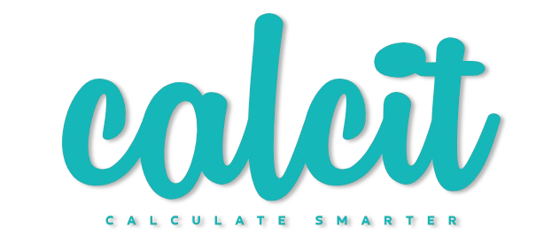

# Calcit



<p style="text-align: center; background-color: rgba(255, 255, 255, 0.05); padding: 10px; border-radius: 5px; color: #15b7b9; font-weight: bold; font-size: 1.1rem; letter-spacing: 0.05rem;">
Your go-to advanced calculators package.
</p>

[](https://www.npmjs.com/package/calc-it)

## Description

**Calcit** is an NPM package that provides various calculations across different categories. It includes loan-related calculations, investment calculations, fitness metrics, and financial ratios. Whether you're calculating EMIs for loans, returns on investments, or tracking fitness metrics, Calcit makes it easy.

## Highlights

- 📊 **Expressive API**: Simple, clean functions.
- ⚡ **Highly performant**: Optimized calculations.
- 🧮 **No dependencies**: Lightweight and easy. No Dependency.
- 🔄 **Modular design**: Pick yourself (loans, investments, fitness, etc.).
- 🌍 **Comprehensive support**: Wide range of calculations.
- 🔍 **TypeScript support**: Strongly typed API.
- 🛠 **Actively maintained**: Regular updates for latest features and improvements.
- 📦 **Used across industries**: Suitable for fintech, fitness, health, and real estate.

## Installation

To install Calcit, run the following command in your project directory:

```bash
npm install calcit
```

## Features

- [Loan-related calculations](#loan-related-calculations) (EMI, total interest, etc.)
- [Investment-related calculations](#investment-related-calculations) (SIP, ROI, compound interest, etc.)
- [Fitness-related calculations](#fitness-related-calculations) (BMI, calorie burn, etc.)
- [Financial ratio calculations](#financial-ratio-calculations) (Debt-to-Income ratio, dividend yield, etc.)

## Loan-related calculations

## Investment-related calculations

## Fitness-related calculations

## Financial ratio calculations

### Maintainers

- [Abhaya Shankar](https://github.com/AbhayaShankar)
- [Gopi Rudra](https://github.com/Gopirudra-hub)

### Contributing

Contributions are welcome!
